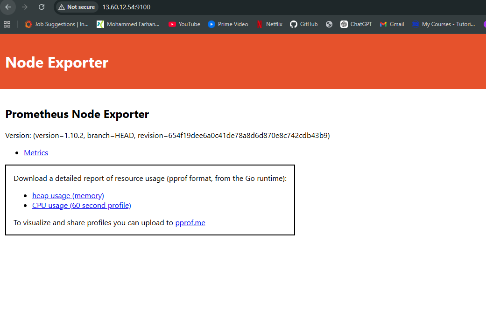
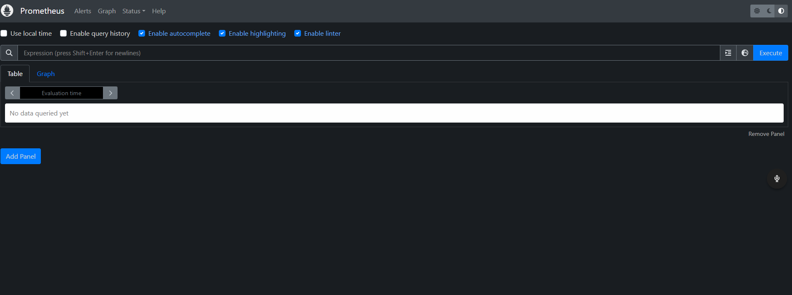
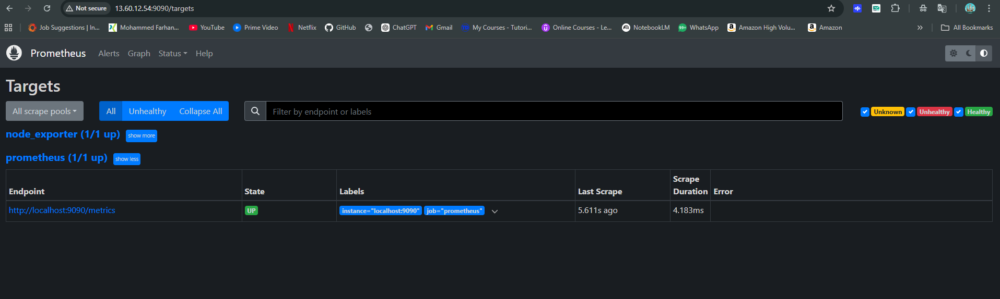
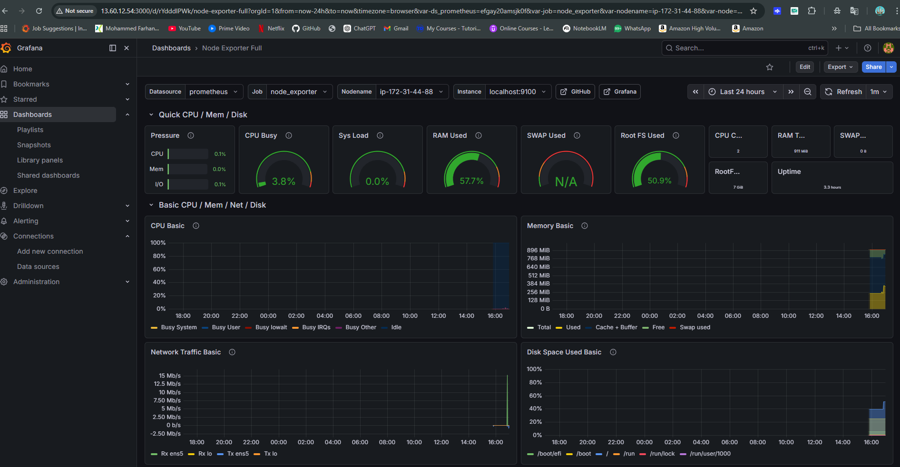

# AWS Monitoring Stack — Prometheus & Grafana

Built a simple monitoring setup on AWS using Prometheus, Node Exporter, and Grafana to track system performance in real time.

## Overview

This project sets up a full observability pipeline on an EC2 instance:

EC2 (Linux) → Node Exporter → Prometheus → Grafana

It collects system-level metrics and visualizes them through dashboards, similar to how real production monitoring works.

---

## What I Did

* Launched an AWS EC2 instance (Ubuntu)
* Installed and configured Node Exporter to collect system metrics
* Set up Prometheus to scrape and store metrics
* Built dashboards in Grafana for CPU, memory, disk, and network monitoring
* Configured AWS security groups to allow access to monitoring services
* Debugged real issues (networking, ports, config errors, service conflicts)
* Added a basic shell script to automate setup

---

## Tech Stack

* AWS EC2
* Linux (Ubuntu)
* Prometheus
* Grafana
* Node Exporter
* Bash

---

## How to Run

Clone the repo and run:

```bash
chmod +x install.sh
./install.sh
```

Then access:

* Prometheus → http://<your-ec2-ip>:9090
* Grafana → http://<your-ec2-ip>:3000

---

## Screenshots

### Node Exporter



### Prometheus UI



### Prometheus Targets



### Grafana Dashboard



---

## Key Takeaways

* Learned how monitoring actually works beyond managed cloud tools
* Understood how metrics flow through a system (exporter → collector → dashboard)
* Got hands-on with Linux, networking, and debugging real deployment issues
* Built something close to real-world DevOps monitoring setups

